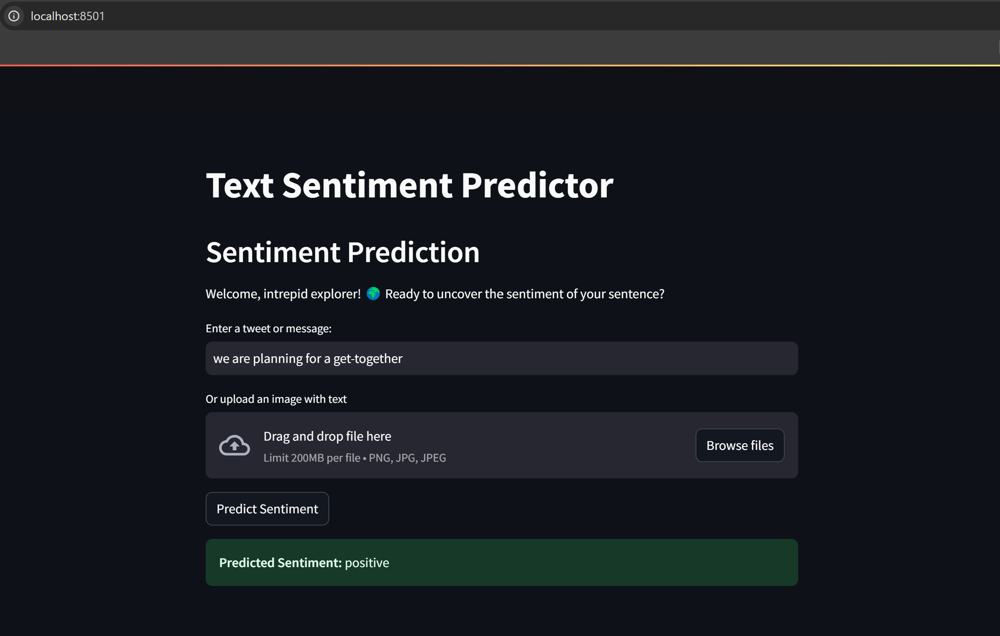
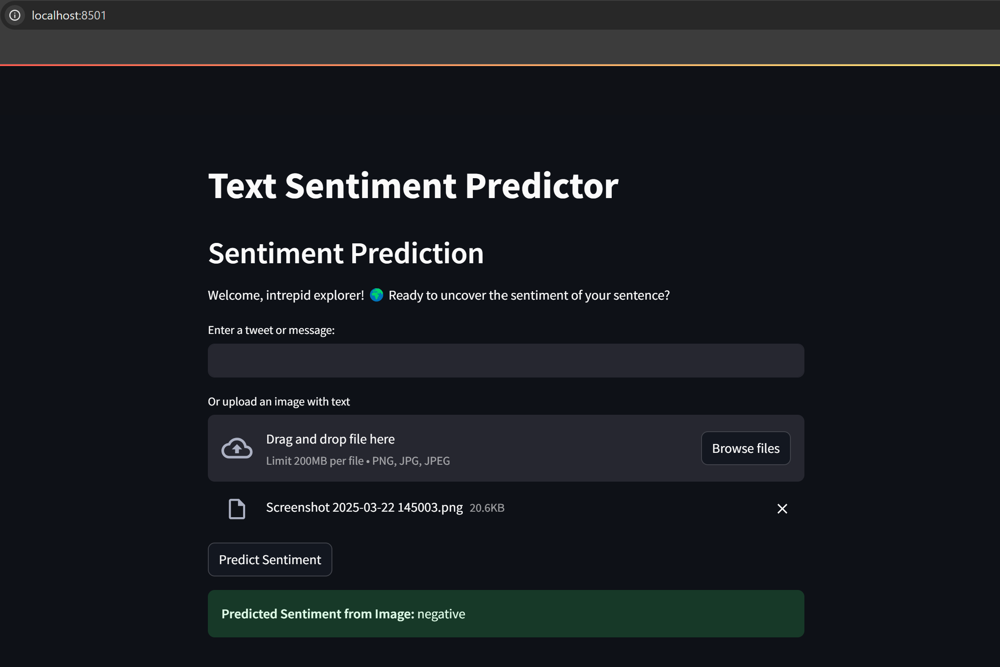

# ✨ Sentiment Predictor

This is a Streamlit-based app that predicts the sentiment of a tweet or text message using a logistic regression classifier. The app also supports sentiment prediction from uploaded images using OCR (Optical Character Recognition) via `pytesseract`.

## 🔍 Features

- Clean and preprocess tweets
- Train and evaluate a logistic regression model using TF-IDF features
- Display classification report and confusion matrix
- Extract top 3 keywords for each sentiment class
- Generate and save a word cloud
- Predict sentiment from user input or uploaded image

## 🧠 Model

- **Vectorizer**: TF-IDF with 5000 max features
- **Classifier**: Logistic Regression
- **Evaluation**:
  - Macro F1 score
  - Confusion matrix (saved to `images/confusion_matrix.png`)
  - Classification report (saved to `reports/sentiment_report.txt`)

## 🖼️ Visuals

- Word cloud saved to `images/wordcloud.png`
- Top entities saved to `reports/top_entities.txt`


---

## 📁 Project Structure
    .
├── data/
│   ├── train.csv
│   └── test.csv
├── images/
│   ├── wordcloud.png
│   └── confusion_matrix.png
├── reports/
│   ├── sentiment_report.txt
│   └── top_entities.txt
├── text_sentiment.py
├── requirements.txt
└── README.md


## How to Run

1. **Install Dependencies:**
```bash
   pip install -r requirements.txt
```
2. **Install Tesseract OCR"**
   Download and install Tesseract OCR https://github.com/tesseract-ocr/tesseract.
   Windows users: During install, make sure to add Tesseract to your system PATH Or manually set the path in the code:
```bash
   pytesseract.pytesseract.tesseract_cmd = r"C:\\Program Files\\Tesseract-OCR\\tesseract.exe"
```
2. **Run the Stearmlit app:**
```bash
   python -m streamlit run text_sentiment.py
```

## App's sample predictions:



